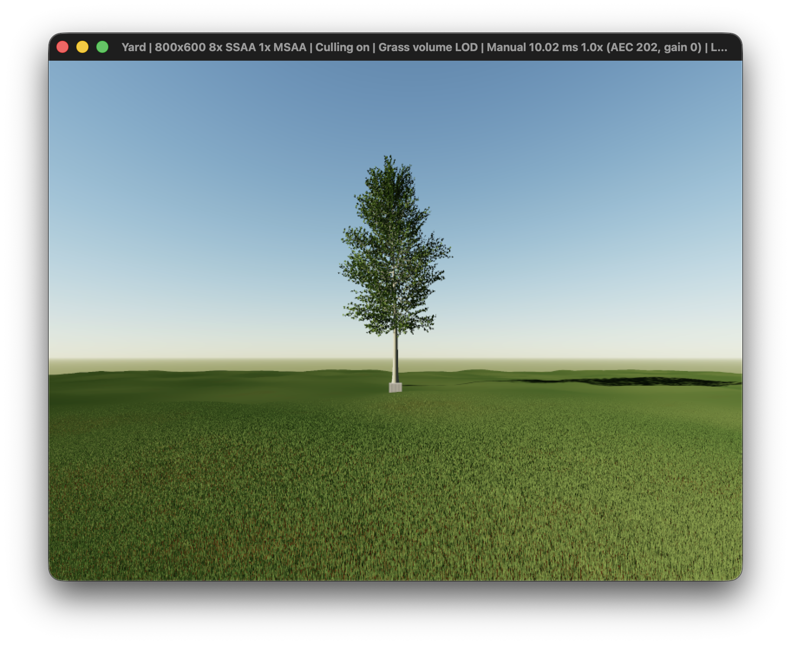

# Materials and foliage shading

The preview uses a restrained material palette, a thin diffuse leaf model and
object sun shadows. These are visual approximations, not measured reflectance or
an OV2640 color calibration. Exposure, tone mapping, visible sky radiance and final camera
resolution retain their existing behavior.

## Palette

Grass uses linear RGB reflectance from (0.043, 0.086, 0.026) to
(0.069, 0.112, 0.039), blended with smooth metre-scale world-space variation.
Blades and volume call the same function at the shading position. No per-frame
randomness or fine procedural noise is added. Tree leaves use sRGB (0.30, 0.40,
0.20); aspen wood uses pale gray (0.62, 0.63, 0.57), other species muted brown
(0.36, 0.30, 0.23). Blossoms use (0.85, 0.62, 0.68). Object material inputs now
use the piecewise sRGB decode, matching the soil's color convention. Leaf/wood
identity is explicit vertex data, independent of palette values.

## Lighting balance

Daytime ambient fill blends a softly cool upper hemisphere with a muted warm/green
lower hemisphere. At high sun the linear RGB endpoints are (0.18, 0.215, 0.25)
and (0.070, 0.075, 0.055), respectively. This lifts red/green in shaded surfaces
and reduces the former blue bias without changing material reflectance or exposure.
A vertical surface receives their equal mix, (0.125, 0.145, 0.1525), compared to
the old (0.065, 0.1105, 0.182).

The endpoints diminish to (0.10, 0.115, 0.15) and (0.025, 0.027, 0.020) near
the horizon, interpolating smoothly with sun elevation over 0–40.5 degrees.
The existing twilight fade gates both; deep night retains only the existing
site-dependent night contribution. Direct sunlight retains its atmospheric color,
intensity and shadow visibility, preserving warm low-sun illumination. The visible
sky and tone curve are unchanged. Grass blades, volume, objects and soil share
this balance; the volume keeps ambient separate from shadowed direct light.

This is an art-directed hemisphere approximation, not sky integration or measured
ground bounce. It does not add occlusion or light transport from nearby objects.

Paused previews at the same manual exposure on 2026-09-15, with 8× SSAA and volume:




The lighting update passed portable shader generation, a warning-free macOS build,
the four-phase Metal smoke check, and a volume/tree orbit with 4× MSAA. The two
window captures check appearance; they do not establish physical calibration.

## Thin foliage

The visible face receives diffuse reflected light and 35% rear diffuse light,
with a green-biased transmission tint. This allows backlit leaves to stay visible
without lighting both sides as if directly illuminated. Leaves and blossoms use
this model; wood, soil and the cube remain opaque diffuse materials. Grass normals
agree with the explicit CCW triangle winding. The volume averages the same leaf
model over 16 azimuths weighted by projected area, separating ambient and direct
terms so only direct sunlight receives shadows at each integration sample.

Transmission is a local shading term, not geometric transparency or multiple
scattering. Leaves remain opaque in camera and shadow depth. Overlapping leaves
can therefore make a canopy shadow too dense. There is no bark texture, waxy
specular response, subsurface transport, ambient occlusion or indirect bounce.

## Sun shadows

A 4096×4096 R32F color attachment records normalized light depth, with a separate
depth attachment for nearest-surface testing. These cost approximately 128 MiB
combined at 32-bit depth, in addition to the supersampled scene. Shadow rendering
and receiver filtering add GPU work; the smoke runs are functional checks, not
isolated performance benchmarks. The existing scene object vertex/index buffers are
reused for the caster pass. Trunks, branches, foliage, the cube and optional
geometry examples cast and receive shadows. Terrain, blades and the grass volume
receive shadows; terrain and grass do not cast them. No moon shadow map is added.

The directional projection is centered at (0, 10, -6), with 52 m half extent or
larger if needed to enclose the object geometry. Its basis follows the shared
simulation sun direction, and its center/extent do not follow the camera. This
avoids camera-driven shadow-grid movement and includes off-camera casters even
when view-frustum culling is enabled. The shadow map is rendered once per sensor
capture, with no caster draw when the sun is below the horizon or shadows are off.

Receivers use a small normal/slope bias and a continuous 4×4 tent PCF. The finite
resolution and bias can miss fine twigs, soften/detach contact edges, or shimmer
as sunlight moves. This is a fixed reconstruction filter, not a physically sized
solar penumbra. Outside the finite light volume, receivers are unshadowed. There
is no temporal accumulation. Grass-volume integration samples the same shadow map
and palette before exposure and supersampling resolve; volume/blade coverage and
lighting remain approximate at their transition. The default smooth transition
now spans 6–18 horizontal metres, retaining nearby blades and distributing the
fade across 12 metres. `--lod-start` and `--lod-end` override these distances;
the wider range submits more blades than the earlier 3–6 m default.

## Compare

```sh
./build/yard --yard-demo --paused --date 2026-09-15 --time 12
./build/yard --yard-demo --paused --grass-volume --date 2026-09-15 --time 12
./build/yard --yard-demo --paused --no-shadows --date 2026-09-15 --time 12
```

H toggles sun shadows, V toggles volume LOD, G toggles grass, and Space resumes the
clock. The normal 8× SSAA default remains enabled. Window resizing and preview
zoom do not change sensor resolution or projection.

Validation includes the warning-free macOS build, all portable shader targets,
the CPU suite, four-phase Metal smoke check, and tree-orbit checks for blades and
volume with 4× MSAA. Paused daytime window captures check material appearance and
visible tree self/ground shadows. These checks do not prove temporal stability,
physical calibration, or runtime portability to the other generated backends.
