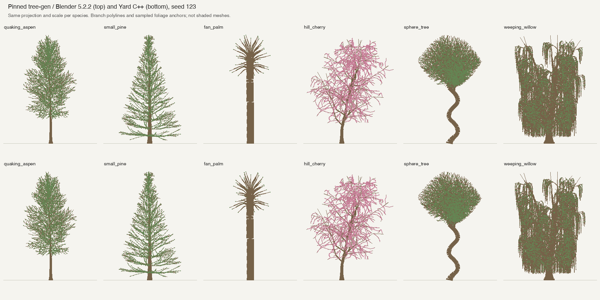

# Tree generation

Yard ports [Charlie Hewitt and Sami Pflibsen-Jones's tree-gen](https://github.com/friggog/tree-gen)
to C++20, against the standalone [geometry engine](GEOMETRY.md). The upstream
Weber–Penn-style algorithm, 20 species presets, ten leaf shapes and three blossom
shapes are pinned to `01e872182a0f955349e51bb1a68ed4dfd665f81c` in
`vendor/tree-gen/`. No Blender, Python, or network access is needed to build or
run Yard. The port is GPLv3; see [NOTICE](../NOTICE), [COPYING](../COPYING), and
the original [README](../vendor/tree-gen/README.md).

```sh
make setup-tools             # only for a new checkout lacking the pinned compiler
make
./build/yard --tree quaking_aspen --date 2026-09-15 --time 12
./build/yard --tree hill_cherry --date 2026-09-15 --time 12
make tree-bench
make test
```

The demo uses seed 123 and places one full-sized tree at the terrain surface beyond
the half-metre reference cube. The
camera remains fixed at SVGA, with the existing projection and manual exposure.
Foliage renders from both sides, with the facing normal used for lighting.
Foliage adds diffuse rear transmission, and tree geometry casts and receives sun
shadows. Aspen bark has a pale gray palette; other presets retain muted brown bark.
Textures, wind and automatic species framing are not implemented. See
[materials and shading](MATERIALS.md) for the approximation limits.
Smoke mode includes a fan palm; it verifies execution, not visual appearance.

The shared renderer defaults to 8× spatial supersampling and supports optional
grass-volume LOD; see the README. Fixed SVGA refers to the final camera image,
not the internal rendering resolution.

Use `--yard-demo --tree SPECIES` for the framed tree/grass preview; see
[yard integration](YARD_DEMO.md).

## Skeleton and meshes

`src/tree.h` exposes three independent operations:

- `species()` / `preset(name)` return named parameter sets. `Parameters` preserves
  upstream names and defaults; the arrays have four levels.
- `generate(parameters, seed, limits)` produces a `Skeleton`: parent indices,
  branch depth, split status, attachment offset, original stem length/radius,
  Bézier points with radii, and foliage anchors/orientations with owning branch
  indices and blossom selections. Coordinates are metres, +Y up and -Z north.
  Splits attach to their source branch even though upstream uses its biological
  parent to calculate length and radius. Split length/offset refer to the original
  stem, not just its remaining segment.
- `mesh(skeleton, detail)` produces separate wood, leaf and blossom indexed meshes
  with normals and UVs. Curve tolerance, maximum segment length and radial count
  affect tessellation only. Foliage can be omitted without regenerating the tree.

This is static procedural morphology. Keeping the skeleton independent makes
seasonal foliage, pruning tools and collision proxies possible future consumers;
none of those systems, persistent growth, or a physics backend is implemented.
Future species-specific roots, sapling development and persistent growth are
outlined in [botanical growth notes](GROWTH_SYSTEM.md); these remain proposals.
Generation-time envelope pruning is part of the imported algorithm and is distinct
from a robot pruning a persistent tree.

The port includes alternate/opposite and whorled branches, fan foliage, fractional
split rounding, base/segment splits, direct splits, curvature, tropism, helical
curves, flare/taper, multi-trunk floor placement, pruning envelopes, leaf bending
and blossoms. Negative `base_splits` retain upstream's behavior: its positive-only
guard makes the documented random-negative mode inactive. Legacy `leaves` keys
in bamboo, sassafras and lombardy_poplar remain ignored, as upstream ignores them.
Pruning preserves upstream's saved split-error list behavior across retries.

Random generation uses an owned MT19937 initialized like Python's integer seed,
including Python's 53-bit draws and save/restore around recursive children. Seed
zero is deterministic in Yard; upstream instead chooses a new seed for zero.
Floating-point differences can change a count at an integer threshold; this is
not a promise of bit-identical output on every compiler or seed.

Blender's empty placeholder splines for rejected branches are omitted. Independent
sweeps overlap at branch junctions: this is not a watertight union, nor a suitable
collision mesh without further processing. Exact zero radii remain in the skeleton;
the mesh substitutes a 10-micrometre capped tip because the geometry engine requires
positive radii. Skeleton control points retain upstream's flare subdivisions, but
render radius interpolation is linear rather than Blender's cardinal interpolation.
Leaf faces use polygon tessellation; nonplanar blossom petals restore their original
3D vertices after triangulation. Planar foliage UVs preserve the rectangle/triangle
coordinates and supply a simple x/z projection for shapes without upstream UVs.
Zero-scale blossoms produce no render geometry.

Invalid/nonfinite parameters throw `invalid_argument`; budget exhaustion throws
`length_error`, without silently truncating the tree. Defaults allow 250,000
branches, four million foliage anchors, four million control points and 16 million
mesh vertices. Floor placement has a bounded retry loop; recursion is limited to 256 active calls. Custom parameter sets may
also hit the geometry engine's degeneracy checks. Large willow presets need hundreds
of MiB: use mesh detail controls, suppress foliage, or set tighter budgets as needed.

## Independent Blender comparison

Reference trees were generated from the **unmodified vendored algorithm** in
Blender **5.2.2 LTS**, seed **123**. The comparison checks every retained branch's
control-point positions/radii and every foliage anchor where counts agree. It also
checks the first 64 tessellation-input vertices of each leaf/blossom material for
five representatives. The ordinary CPU test uses compact independent samples in
`tests/data/tree-reference.txt`, including willow, and exercises all 20 presets.

| Species | Branches | Foliage anchors | Maximum branch position difference | Maximum anchor difference |
| --- | ---: | ---: | ---: | ---: |
| quaking_aspen | 1,161 | 21,797 | 0.00000395 m | 0.00000390 m |
| small_pine | 664 | 56,169 | 0.00000247 m | 0.00000252 m |
| fan_palm | 48 | 4,230 | 0.00000110 m | 0.00000087 m |
| hill_cherry | 430 | 4,161 | 0.00000529 m | 0.00000514 m |
| sphere_tree | 1,233 | 13,539 (Blender 13,542) | 0.000756 m | counts differ; ordered comparison skipped |
| weeping_willow | 33,133 | 303,972 | 0.0000151 m | 0.0000160 m |

All six match retained branch topology. The helix's tangent-derived frame amplifies
small numerical differences; three foliage anchors differ at count-rounding
thresholds. Sampled foliage mesh vertices differ by less than 0.000019 m (helix)
and 0.00000072 m (other sampled species). These checks establish representative
structural agreement, not photorealism or parity for all parameter combinations.



Top: Blender. Bottom: Yard. These are identical front projections of the skeletons
with sampled foliage anchors, **not shaded mesh renders**. The comparison image was
inspected for gross structural differences. It cannot validate shading, sweep
junctions, silhouettes of individual leaves, or interactive camera behavior.

Reproduce one comparison (Blender installed separately):

```sh
make build/tree-bench
./build/tree-bench quaking_aspen build/aspen.txt
/Applications/Blender.app/Contents/MacOS/Blender --background --factory-startup \
    --python tools/tree-blender-reference.py -- quaking_aspen build/blender-aspen.json
python3 tools/compare-tree-reference.py build/blender-aspen.json build/aspen.txt
```

The helix comparison requires `--leaf-count-tolerance 5`; positional tolerance
remains 0.002 m. Reference extraction and plotting scripts list the six input file
names; `tools/plot-tree-reference.py` optionally uses Pillow and macOS Helvetica.
Full reference JSON/dumps stay in ignored `build/`; compact golden samples and the
comparison image are checked in. `tools/import-tree-presets.py` regenerates checked-in
C++ data offline via Python AST literals, without executing Blender modules.

## Measurements

Single-process local Apple Silicon/macOS run, `xcrun clang++ -O3 -DNDEBUG`, seed 123.
Default Yard mesh detail: 8 radial segments, 0.01 m chord error, 0.25 m maximum
segment length, all foliage. Times are single samples, not statistical performance
claims. [All 20 measurements](tree-reference/benchmark.txt) include owned mesh
storage (32-byte vertices plus 32-bit indices), excluding allocator overhead,
skeletons, temporary buffers, and renderer uploads.

| Species | Skeleton ms | Mesh ms | Vertices | Triangles | Mesh MiB |
| --- | ---: | ---: | ---: | ---: | ---: |
| quaking_aspen | 4.67 | 14.78 | 580,830 | 420,931 | 22.54 |
| small_pine | 7.26 | 26.46 | 998,662 | 449,487 | 35.62 |
| fan_palm | 0.76 | 1.93 | 56,631 | 80,790 | 2.65 |
| hill_cherry | 2.10 | 5.25 | 232,963 | 187,532 | 9.26 |
| sphere_tree | 4.96 | 9.71 | 360,795 | 265,943 | 14.05 |
| weeping_willow | 84.44 | 232.13 | 7,440,199 | 4,620,288 | 279.93 |
| weeping_willow_o | 165.14 | 535.18 | 15,574,767 | 9,261,026 | 581.29 |

Initial Blender reference timings (same machine/seed) were 330/431 ms for aspen,
439/790 ms for pine, 105/90 ms for fan palm, 123/140 ms for cherry, 284/234 ms for
sphere and 16,272/4,839 ms for willow (skeleton/mesh respectively). Blender produced
1,654,567 / 1,038,639 / 2,041,974 / 1,366,596 / 703,782 / 17,277,636 triangles.
Blender uses its native preset curve/bevel resolution and includes Blender object
and evaluation overhead; Yard uses different tessellation and normals/UV seams.
These are workload measurements, **not an equal-quality tessellator benchmark**.

Validation: warning-free app build and portable shader generation; `make test`;
all-preset optimized mesh benchmark; desktop Metal smoke test (120 SVGA frames,
four lunar phases). The sandboxed GUI launch stalled on macOS service access and
was stopped; the successful run was outside the sandbox.
