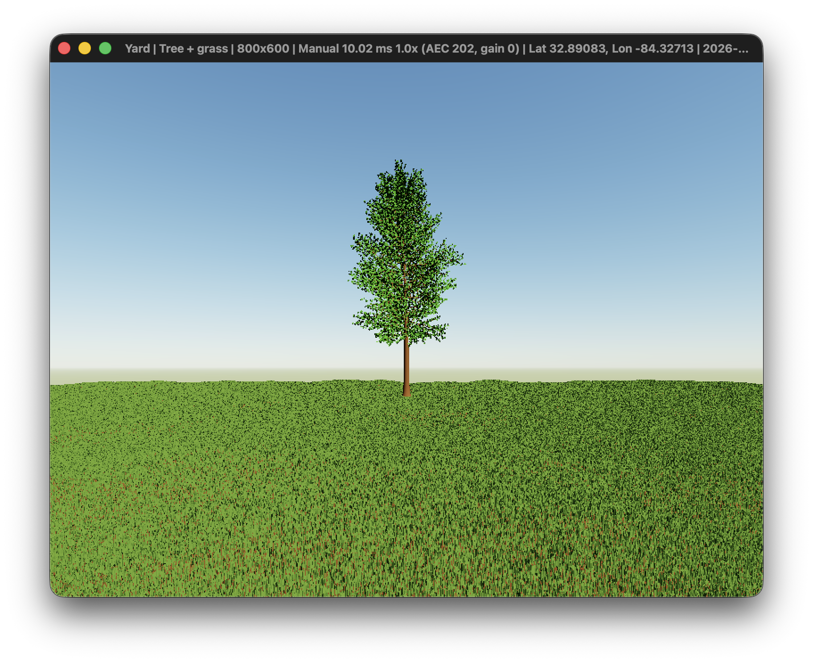

# Combined tree, grass and terrain preview

`--yard-demo` selects an optional static yard scene. It defaults to a seeded
quaking aspen; `--tree NAME` selects any tree-gen preset. The viewer starts 24 m
from the trunk, with the full default crown in view. Mouse look/WASD retain their
usual behavior, while eye height follows the density-derived surface at 1.6 m.
G toggles grass; `--no-grass` is useful for inspecting trunk/soil contact.

The tree's world root is (0, terrain height − 0.02 m, −6). Tree geometry is not
rotated by the sky demo's shared cube angle. Wood, leaves, soil and grass share
the same camera, manual exposure, sunlight, ambient lighting and depth buffer.
There is no rigid-body collision, wind, growth or general shadow pass. Root
embedding hides small extraction/interpolation discrepancies; it does not deform
the terrain or remove grass under the trunk. The original sky and geometry demos
remain available without `--yard-demo`.



The launch view was visually checked in a captured Yard window: the default crown
is visible and the trunk meets the terrain. Grass and foliage aliasing remain
visible at the fixed sensor resolution. Keyboard/navigation behavior was not
automatically exercised.

## Reused prototype

Terrain density, marching cubes, grass layout and conservative region culling
come from `prototype/voxel-yard` at
`78faa70c7617b5778ba5be4cbdedd3f5ba3932b8`, adapted from C11 to C++20. Marching
cubes retains the pinned BSD-3-Clause PyMCubes tables and their license in
`vendor/marching_cubes`. `src/yard_scene.cpp` uploads the prototype geometry using
the current vendored Sokol API. All shader targets are still generated offline.

The 63.61 m square has 1 cm density columns and a 64 cm vertical slab. Marching
cubes samples at 4 cm spacing, with interpolated crossings and normals. The seed
produces 5,557,104 terrain triangles and 40,462,321 possible grass blades. Each
blade is a 5 cm × 5 mm upright triangle with a deterministic randomized root and
azimuth. 625 static 2.56 m regions are culled independently for terrain and grass.
These are draw groups, not streamed simulation chunks.

The density volume uses 2,589,588,544 bytes (about 2.41 GiB), plus CPU heights,
GPU roots and meshes. CPU extraction meshes and temporary packed roots are freed
after upload; density and navigation heights remain until shutdown. Initialization
is synchronous and takes several seconds. The scene currently renders full grass
density in visible regions. Its single-sample 800×600 image can alias at distance.
The prototype's optional grass volume LOD and supersampled camera pipeline are
not part of this integration.

## Validation

`make test` includes the imported marching-cubes topology/interpolation tests and
frustum-culling/region-layout checks alongside the tree, geometry, camera and
astronomy tests. The app builds without warnings. `make yard-smoke-test` renders
120 frames while orbiting the combined scene at fixed local noon; `make smoke-test`
continues to check the four lunar phases. Both passed on Metal in the desktop
session. Output stays 800×600 at a maximum of 30 fps; the smoke log does not measure
sustained throughput or establish interactive behavior.

```sh
make run-yard
./build/yard --yard-demo --tree hill_cherry --date 2026-09-15 --time 12
./build/yard --yard-demo --no-grass --date 2026-09-15 --time 12
make yard-smoke-test
```
